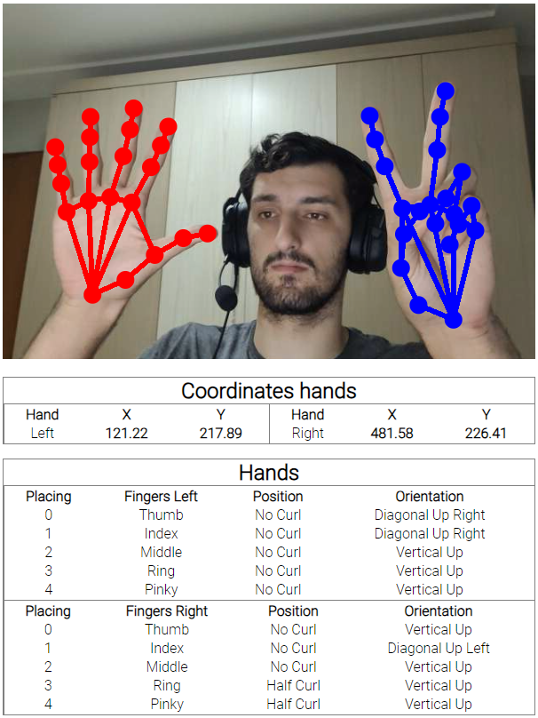

# Nome do Projeto

Este projeto tem como objetivo implementar um sistema de reconhecimento de gestos utilizando as poderosas bibliotecas TensorFlow e Fingerpose. O TensorFlow será utilizado para treinar e implantar modelos de aprendizado de máquina que detectam e reconhecem padrões de gestos das mãos. Por outro lado, o Fingerpose proporcionará uma interface simplificada para interpretar e utilizar esses gestos de maneira intuitiva.


## Tabela de Conteúdos

- [Sobre o Projeto](#sobre-o-projeto)
- [Pré-requisitos](#pré-requisitos)
- [Contribuição](#contribuição)
- [Licença](#licença)

## Sobre o Projeto

Este projeto tem como objetivo explorar e aplicar a biblioteca TensorFlow para reconhecimento de gestos das mãos, utilizando técnicas de machine learning. O foco principal foi entender o funcionamento e potencialidades desta poderosa ferramenta de aprendizado de máquina.

## Pré-requisitos
Para implementar a detecção e o reconhecimento de gestos das mãos em um projeto, é necessário incorporar os seguintes scripts CDN do TensorFlow:

```html
    <script src="https://cdn.jsdelivr.net/npm/@tensorflow/tfjs-core"></script>
    <script src="https://cdn.jsdelivr.net/npm/@tensorflow/tfjs-converter"></script>

    <!-- You must explicitly require a TF.js backend if you're not using the TF.js union bundle. -->
    <script src="https://cdn.jsdelivr.net/npm/@tensorflow/tfjs-backend-webgl"></script>

    <script src="https://cdn.jsdelivr.net/npm/@tensorflow-models/hand-pose-detection"></script>
    <!-- fingerpose CDN -->
    <!-- <script src="https://cdn.jsdelivr.net/npm/fingerpose@0.1.0/dist/fingerpose.min.js" type="text/javascript"></script> -->
    <!-- Handpose load -->
    <script src="https://unpkg.com/@tensorflow-models/handpose@0.0.6/dist/handpose.js"></script> 

    <!-- fingerpose CDN -->
    <!-- <script src="https://cdn.jsdelivr.net/npm/fingerpose@0.1.0/dist/fingerpose.min.js" type="text/javascript"></script> -->
```
Esses requisitos são essenciais para a integração bem-sucedida da detecção e do reconhecimento de gestos utilizando o TensorFlow e a biblioteca Handpose. Certifique-se de incorporar esses scripts em seu projeto para garantir o funcionamento correto da funcionalidade de gestos das mãos.
Vamos precisar também da biblioteca fingerpose do [Erick Wendel](https://github.com/ErickWendel/fingerpose/tree/master), que é baseado no módulo *FingerPoseEstimate*. Desenvolvido por [Prasad Pai](https://github.com/Prasad9/Classify-HandGesturePose)


## Licença

Indique a licença sob a qual o seu projeto está disponível. Por exemplo: [Licença MIT](LICENSE).
